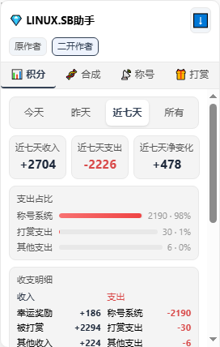
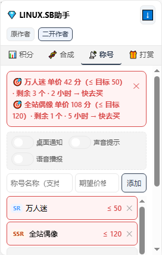
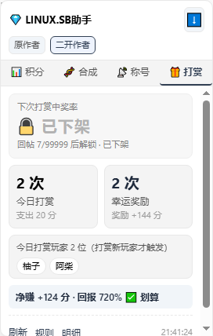

# LINUX.SB助手（二开版）

一个面向 [linux.sb](https://linux.sb) 论坛的 Tampermonkey 油猴脚本：把积分流水、称号合成、称号市场行情、幸运打赏四类数据收进页面右上角一个可拖动的浮窗，切标签页就看。浮窗高度最多为视口的一半，内容超出时在浮窗内部滚动；抓取数据时顶部会显示进度。浮窗平时是收起的，入口按钮嵌在站点顶栏最后一格（搜索框右边），点一下展开；点网页其他地方它自己就收起来了，不会一直占着页面。

> 本仓库是**二开版**，底子来自论坛用户 **豆包本包** 的原版《LINUX.SB助手》。原作者的脚本地址与主页见下方[「原作者」](#原作者)一节，请先支持原作者。

*截图为面板 UI 演示，其中的数据为示例数据，不是真实账号流水。*

## 功能

### 积分

- 今天 / 昨天 / 近七天 / 所有 四档筛选，切换即重算；选「所有」会一直翻到最后一页，统计全量记录
- 抓取时顶部显示进度条（`抓取中 N/M 页`），完成提示 `✓ 已更新`，失败提示 `✗ 抓取失败`
- 收入 / 支出 / 净变化 三个数字卡（标题跟随所选范围）
- 支出占比条形图 + 收支明细（收入 / 支出分列）+ 时间线
- 收入按来源分开记，「其他收入」只剩零星项：幸运奖励 / 被打赏 / 称号出售 / 每日签到 / 广告奖励 / 小游戏奖励 / 精华奖励 / 发帖奖励 / 回帖奖励（空的那类不显示）
- 底部一键跳「积分明细」核对原始记录

### 合成

- 今天 / 昨天 / 近七天 / 所有 四档筛选，与积分一致
- 只认「批量熔炼」和「配方合成」两类通知；称号回收、称号售出、打赏、提及、抽奖、赠送、点赞、兑换等一律不计入
- 面板底部显示「已过滤 N 条非合成通知」，过滤了多少一目了然，不用猜有没有漏
- 合成所得按称号名反查真实级别（拉取 `/gacha` 的全量称号池做映射），显示成 `万人迷 SR ×7` 这种「名称 + 级别 + 数量」，再按级别汇总成一屏占比
- 合成次数 / 消耗称号 / 获得称号 三个数字卡，消耗侧按稀有度出条形占比

### 称号

- 按「称号名 + 期望价」建监控项，称号名支持部分匹配
- 10 秒轮询交易市场最新发布，命中价格阈值时卡片高亮，可直接点进市场
- 达标的挂单同步到「最新挂单快照」，下架或不再达标时自动移除
- 可选桌面通知 / 声音提示 / 语音播报，监控随时启停

### 打赏

- 今日打赏次数、幸运奖励收入两个卡片，并显示今日净投入
- 按规则估算「下次打赏中奖率」（回帖数达标才解锁概率）
- 列出今日打赏过的玩家名单，附规则与明细入口

## 二开版相对原版改了什么

| 改动 | 说明 |
| --- | --- |
| 合成通知过滤 | 回收 / 售出等通知不再被误当成合成所得，并显示过滤条数 |
| 合成所得标注级别 | 从称号池反查真实级别，不再只按批次稀有度笼统归堆 |
| 标签页顺序 | 合成挪到积分之后，常用功能靠前 |
| 头部署名 | 标题行右侧一个「关于」，点开在面板内显示原作者 / 二开作者 / 仓库地址 / 版本等信息 |
| 精简按钮 | 去掉冗余的复制按钮，底部按钮不再折行 |
| 移除自动更新地址 | 删掉指向原版脚本的 `@downloadURL` / `@updateURL`，避免被原版覆盖 |
| 「所有」筛选 | 积分 / 合成在近七天之后增加全量档位，翻到最后一页 |
| 抓取进度条 | 加载 / 刷新 / 切范围时显示 `抓取中 N/M 页`，完成提示 `✓ 已更新` |
| 面板停靠与限高 | 由右下角改为右上角，高度不超过视口一半，超出部分面板内滚动 |
| 收起态入口按钮 | 收起后入口按钮嵌进站点顶栏「搜索框之后」那一格，与主题自带的「切换色系」按钮同尺寸同配色；点击开合面板，称号监控命中时按钮右上角显示未读红点 |
| 取数改走页面 fetch | 不再用 `GM_xmlhttpRequest`，改用页面自身的 `fetch`（同源同会话），避开站点 Cloudflare 对扩展通道请求的拦截；扩展通道保留为兜底 |
| 收入来源细分 | 原版把所有进账并成「其他收入」；本版按来源拆成 称号出售 / 每日签到 / 广告奖励 / 小游戏奖励 / 精华奖励 等，只有认不出的零星进账才落「其他收入」 |

## 原作者

这个脚本的底子是论坛用户 **豆包本包** 的原版《LINUX.SB助手》：

- 脚本头部 `@author`：干货助手
- 论坛主页：<https://linux.sb/user/313>
- 原版发布于 GreasyFork，脚本 ID `593970`

积分分析、称号市场监控、幸运打赏这三块的核心实现都来自原版。二开版只是在它基础上补齐了称号合成的统计细节、调整了排版与署名，**功劳主要在原作者**，用着顺手的话去原帖给作者点个赞。

## 安装

1. 浏览器安装 [Tampermonkey](https://www.tampermonkey.net/) 扩展
2. 打开 Tampermonkey 面板 → 「添加新脚本」
3. 把本仓库的 [`LINUX.SB助手.user.js`](./LINUX.SB助手.user.js) 全文粘贴进去，保存（Ctrl / Cmd + S）
4. 打开 linux.sb，页面右上角出现浮窗即生效

安装过旧版的，直接在 Tampermonkey 里更新脚本内容，版本号以脚本头 `@version` 为准；改过缓存结构时旧缓存会自动作废、首次打开重新抓取。

## 数据与隐私

- 只请求 linux.sb 域名下的页面，读取的是**你自己登录态下**能看到的积分明细与通知列表
- 请求走页面自身的 `fetch`，Cookie / Referer 与你在页面上点链接跳转完全一致（`@connect linux.sb` 的扩展通道只作兜底，正常情况用不到）
- 抓取节奏：1 秒 1 页；按天档位抓到下界即停，选「所有」则翻到最后一页（安全上限 40 页）；称号市场 10 秒轮询一轮
- 再次打开页面（或 10 分钟定时刷新）时会先只抓第 1 页与缓存比对，没有新记录就直接复用缓存、不再逐页翻取；手动点「刷新」始终走全量抓取
- 面板收起时不做任何刷新
- 统计全部在本地浏览器计算，缓存写在 `localStorage`，不上传任何服务器

## 常见问题

**面板数字是 0 / 没有统计出消耗和合成？**
先确认 Tampermonkey 里装的版本号是不是最新的，旧版不会生效。

**合成统计里少了某几条合成？**
底部会写明「已过滤 N 条非合成通知」，那 N 条是回收 / 售出 / 打赏等非合成通知。如果确认某条合成通知被漏掉，把原始文案发出来即可。

**称号市场监控没反应？**
监控需要先添加监控项并点「开始监控」，且只在页面打开时轮询。

**底部提示「第 1 页请求失败：HTTP 403」或「网络错误」？**
站点挂了人机校验，扩展通道的请求被挡了，升到 1.1.3 起改走页面 fetch 即可恢复。

## 更新日志

### 1.1.5

- **积分收入按来源细分**：以前收入只有「幸运奖励 / 被打赏 / 其他收入」三类，于是每日签到、出售称号、看广告、小游戏这些进账全被并进「其他收入」，看着像来路不明。现在按站点流水里的实际文案拆开：
  - 新增 **称号出售**（`出售称号「…」` 与 `SSR 回收:称号系统` 合并，回收的文案里也带「称号系统」，规则顺序上要排在抽奖前面才不会被抢走）
  - 新增 **每日签到 / 广告奖励 / 小游戏奖励 / 精华奖励 / 发帖奖励 / 回帖奖励**
  - 规则同时补上了 邀请奖励、回帖投币、虚拟卡兑换 等零星文案，认不出的才落「其他收入」
- 收入明细只显示有数据的那几类，空的不占位置；支出侧分类不变（称号系统 / 打赏支出 / 其他支出）
- 时间线同步用上新的分类名，不再出现「其他收入 ×N」这种笼统分段

### 1.1.4

- **收起后的入口按钮改嵌在站点顶栏最后一格**（搜索框右边，紧挨主题自带的「切换色系」按钮）。尺寸 30×30、圆角 4px、边框与配色全部取自站点变量，站点换色系时跟着变，看起来就是顶栏自带的一个按钮
- 点它开合面板；面板展开时默认停在顶栏下方，不再盖住顶栏和入口按钮
- 顶栏若被站点重绘把按钮挤掉，脚本会把它放回原位；顶栏里找不到插槽（窄屏布局等）时退回右上角的圆形浮标，浮标仍可按住在页面上拖动
- **进页面时面板默认收起，不再记住上次的展开状态**：刷新或点进任何一页，看到的都是干净的页面 + 顶栏那个入口按钮
- **点面板和入口按钮以外的地方，面板自动收起**（点面板内部、拖动、点入口按钮都不会误收）
- 四个标签页与数据都跟以前一样
- **面板头部的收起箭头去掉**：开合面板统一由顶栏那一格的入口按钮负责，面板里不再重复放一个
- **「原作者 / 二开作者」两个入口收进「关于」**：标题行右侧新增「关于」，点开就地盖掉整个面板（标题行、标签页、内容区一起让位），显示版本、原作者、二开作者、仓库地址与三小段说明；点 ✕、按 Esc、或点网页其他地方都能关掉。关于只占面板自己的位置，不铺满屏幕、不加暗色遮罩，面板以外的网页照常能点
- 关于里的版本号实时读 `GM_info`，装的哪版就显示哪版

### 1.1.3

- **修复取数被站点 Cloudflare 拦截（`第 1 页请求失败：HTTP 403` / `网络错误`）**：站点开启了人机校验后，`GM_xmlhttpRequest` 发出的请求不带你浏览器上的放行票据，会被回一个 `Just a moment...`（403）或直接掐断，表现是每个标签页都抓不到数据
- 改为用**页面自身的 `fetch`** 取数：同源同会话，Cookie / Referer / `Sec-Fetch-*` 与你在页面上点链接跳转完全一致，站点按正常浏览放行；`GM_xmlhttpRequest` 保留为页面 fetch 不可用时的兜底
- 抓取到的内容与节奏都没变（仍是 1 秒 1 页、上限 40 页），只是换了条通道

### 1.1.2

- **收起后只剩一个圆形图标**：以前收起只是把内容藏起来，标题行和四个标签页还占着位置；现在收起后整个面板缩成一个 32px 圆形图标，页面上只剩它
- 图标点击即展开，按住可直接拖动（拖动过 4px 才算拖，避免手抖把点击吃掉）
- 称号监控命中时，图标右上角显示未读红点与条数（超过 99 显示 `99+`），和标题栏标签页角标同步；打开「称号」标签页后清零
- 修复贴在屏幕边缘时的越界：拖动图标到右下角再展开，面板会被自动夹回视口内，不会顶出屏幕

### 1.1.1

- 大幅减少重复抓取：再次打开页面（或 10 分钟定时刷新）时，先只抓第 1 页与缓存比对，没有新记录就直接复用缓存、不再逐页翻取。此前每次打开页面都会把所选范围整轮重抓一遍（近七天约 11 个请求，选「所有」约 18 个），现在没有变化时只需 1 个
- 手动点「刷新」仍然走全量抓取，用于强制核对最新数据

### 1.1.0

- **新增「所有」筛选（积分 / 合成）**：在原来三档之后增加一档「所有」，一直翻到最后一页统计全量记录；从「所有」切回按天档位直接本地重算，不重复抓取
- **新增抓取进度条**：首次加载、点「刷新」、切换筛选范围时，面板顶部显示「抓取中 N/M 页」并按页推进，完成后短暂显示「✓ 已更新」，失败显示「✗ 抓取失败」
- **面板改为停靠右上角**，展开高度不超过视口的一半，内容超出时在面板内部滚动，不再顶出屏幕
- **修复合成统计拿不到数据**：此前若第 1 页通知里没有合成记录（常见，最近多是打赏 / 提及），脚本会误判「通知没有可识别时间」而提前停止翻页，导致后面几页的熔炼记录永远统计不到。现在时间探测对整页通知进行，并按抓取下界正确停止
- **修复失败结果被当成当天缓存**：某次抓取若没命中任何记录，会被写入缓存并复用一整天，表现为「更新了脚本也还是不显示」；现在空结果不缓存，旧的空缓存自动忽略并重抓
- **修复称号监控整轮中断**：`removeSnapshotRow` 从未定义，只要有监听项没有达标挂单就会抛异常、整轮检查失效；同时补上「最新挂单快照」的写入逻辑（该区块此前一直为空）

### 1.0.0

- 首个二开版：积分分析、称号合成统计、称号市场监控、幸运打赏四个标签页

## 许可

脚本头声明为 MIT，随原版脚本一并沿用。
