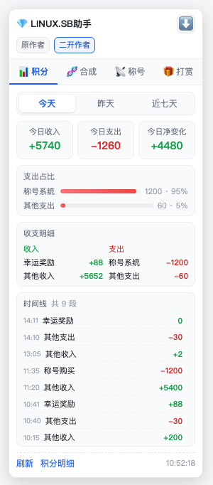
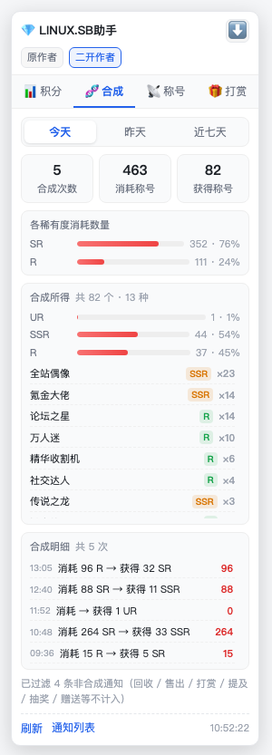

# LINUX.SB助手（二开版）

一个面向 [linux.sb](https://linux.sb) 论坛的 Tampermonkey 油猴脚本：把积分流水、称号合成、称号市场行情、幸运打赏四类数据收进页面右下角一个可拖动的浮窗，切标签页就看。

> 本仓库是**二开版**，底子来自论坛用户 **豆包本包** 的原版《LINUX.SB助手》。原作者的脚本地址与主页见下方[「原作者」](#原作者)一节，请先支持原作者。

*截图为面板 UI 演示，其中的数据为示例数据，不是真实账号流水。*

## 功能

### 积分

- 今天 / 昨天 / 近七天 三档筛选，切换即重算
- 今日收入、今日支出、今日净变化 三个数字卡
- 支出占比条形图 + 收支明细（收入 / 支出分列）+ 时间线
- 底部一键跳「积分明细」核对原始记录

### 合成

- 只认「批量熔炼」和「配方合成」两类通知；称号回收、称号售出、打赏、提及、抽奖、赠送、点赞、兑换等一律不计入
- 面板底部显示「已过滤 N 条非合成通知」，过滤了多少一目了然，不用猜有没有漏
- 合成所得按称号名反查真实级别（拉取 `/gacha` 的全量称号池做映射），显示成 `万人迷 SR ×7` 这种「名称 + 级别 + 数量」，再按级别汇总成一屏占比
- 合成次数 / 消耗称号 / 获得称号 三个数字卡，消耗侧按稀有度出条形占比

### 称号

- 按「称号名 + 期望价」建监控项，称号名支持部分匹配
- 10 秒轮询交易市场最新发布，命中价格阈值时卡片高亮，可直接点进市场
- 可选桌面通知 / 声音提示 / 语音播报，监控随时启停

### 打赏

- 今日打赏次数、幸运奖励收入两个卡片，并显示今日净投入
- 按规则估算「下次打赏中奖率」（回帖数达标才解锁概率）
- 列出今日打赏过的玩家名单，附规则与明细入口

## 二开版相对原版改了什么

| 改动 | 说明 |
| --- | --- |
| 合成通知过滤 | 回收 / 售出等通知不再被误当成合成所得，并显示过滤条数 |
| 合成所得标注级别 | 从称号池反查真实级别，不再只按批次稀有度笼统归堆 |
| 标签页顺序 | 合成挪到积分之后，常用功能靠前 |
| 头部署名 | 标题下方并排显示原作者与二开作者入口 |
| 精简按钮 | 去掉冗余的复制按钮，底部按钮不再折行 |
| 移除自动更新地址 | 删掉指向原版脚本的 `@downloadURL` / `@updateURL`，避免被原版覆盖 |

## 原作者

这个脚本的底子是论坛用户 **豆包本包** 的原版《LINUX.SB助手》：

- 脚本头部 `@author`：干货助手
- 论坛主页：<https://linux.sb/user/313>
- 原版发布于 GreasyFork，脚本 ID `593970`

积分分析、称号市场监控、幸运打赏这三块的核心实现都来自原版。二开版只是在它基础上补齐了称号合成的统计细节、调整了排版与署名，**功劳主要在原作者**，用着顺手的话去原帖给作者点个赞。

## 安装

1. 浏览器安装 [Tampermonkey](https://www.tampermonkey.net/) 扩展
2. 打开 Tampermonkey 面板 → 「添加新脚本」
3. 把本仓库的 [`LINUX.SB助手.user.js`](./LINUX.SB助手.user.js) 全文粘贴进去，保存（Ctrl / Cmd + S）
4. 打开 linux.sb，页面右下角出现浮窗即生效

安装过旧版的，直接在 Tampermonkey 里更新脚本内容，版本号以脚本头 `@version` 为准；改过缓存结构时旧缓存会自动作废、首次打开重新抓取。

## 数据与隐私

- 只请求 linux.sb 域名下的页面（`@connect linux.sb`），读取的是**你自己登录态下**能看到的积分明细与通知列表
- 抓取节奏：1 秒 1 页、最多 40 页；称号市场 10 秒轮询一轮
- 面板收起时不做任何刷新
- 统计全部在本地浏览器计算，缓存写在 `localStorage`，不上传任何服务器

## 常见问题

**面板数字是 0 / 没有统计出消耗和合成？**
先确认 Tampermonkey 里装的版本号是不是最新的，旧版不会生效。

**合成统计里少了某几条合成？**
底部会写明「已过滤 N 条非合成通知」，那 N 条是回收 / 售出 / 打赏等非合成通知。如果确认某条合成通知被漏掉，把原始文案发出来即可。

**称号市场监控没反应？**
监控需要先添加监控项并点「开始监控」，且只在页面打开时轮询。

## 许可

脚本头声明为 MIT，随原版脚本一并沿用。
